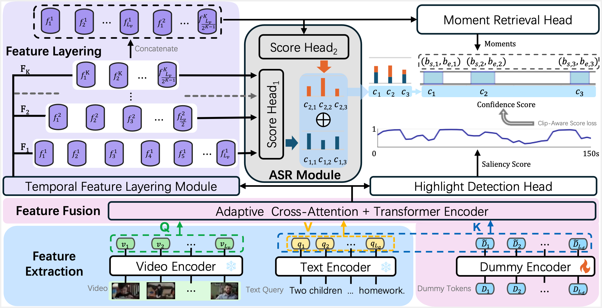

# FlashVTG: Feature Layering and Adaptive Score Handling Network for Video Temporal Grounding

This repository is the official implementation of the paper **FlashVTG: Feature Layering and Adaptive Score Handling Network for Video Temporal Grounding**. (WACV 2025)

> Zhuo Cao, Bingqing Zhang, Heming Du, Xin Yu, Xue Li, Sen Wang
>
> The University of Queensland, Australia

[**Preparation**](#-Preparation) | [**Training**](#-training) | [**Inference and Evaluation**](#-Inference-and-Evaluation) 

<p align="center"></p>

## 🔨 Preparation

1. Set up the environment for running the experiments.

   - Clone this repository.

     ```bash
     git clone https://github.com/Shuaicong97/FlashVTG.git
     ```
     
   - Download the packages we used for training. Python version 3.12.2 is required for reproduce.

     `pip install -r requirements.txt`

2. Download datasets.

    For path and feature extracted by InternVideo2, you can download from [Google Drive](https://drive.google.com/drive/folders/1ENhgqwiSmCHxNsADIUdMBpF3lUww4ULG?usp=sharing).

<br>
Note:

- Since this repository serves as the baseline for the ICCV 2025 Workshop, the original test set will not be provided. If you need to test, please split the training set. Create the required files in the format of `highlight_train_release_IV2.jsonl` and `highlight_val_release.jsonl`.


## 🏋️ Training

We provide training scripts for all datasets in `FlashVTG/scripts/` directory.

### OVIS

For Internvideo2 feature:

```shell
bash FlashVTG/scripts/qv_internvideo2/train_ovis.sh
```

### MOT17

For Internvideo2 feature:

```bash
bash FlashVTG/scripts/qv_internvideo2/train_mot17.sh
```

### MOT20

```shell
bash FlashVTG/scripts/qv_internvideo2/train_mot20.sh
```

## 🏆 Inference and Evaluation

Using ``inference.sh`` to do inference. Hint: ``data/MR.py`` for Moment Retrieval task and ``data/HD.py`` for Highlight Detection task. Here is a sample shows how to use ``inference.sh``.

```shell
bash FlashVTG/scripts/inference.sh data/MR.py results/QVHihlights_IV2/model_best.ckpt 'val'
```

For QVHighlights test set, you could do the evaluation on [codalab](https://codalab.lisn.upsaclay.fr/competitions/6937). For more details, check [standalone_eval/README.md](standalone_eval/README.md).

# Acknowledgements

This work is supported by Australian Research Council (ARC) Discovery Project DP230101753 and the code is based on [CGDETR](https://github.com/wjun0830/CGDETR/).